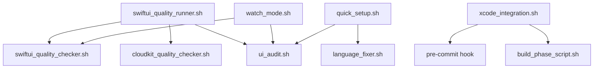
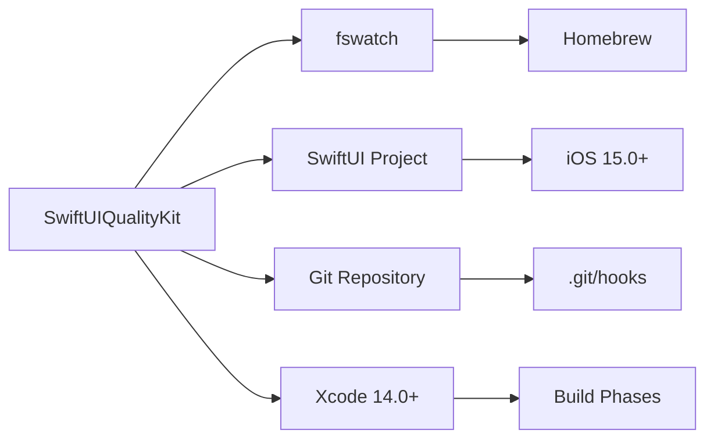

# SwiftUIQualityKit パッケージ構造

**delax-shared-packages統合用パッケージ構造**

## 📁 ディレクトリ構造

```
SwiftUIQualityKit/
├── 📄 README.md                    # メインドキュメント
├── 📄 QUICKSTART.md                # 5分で始められるガイド  
├── 📄 TROUBLESHOOTING.md           # 問題解決ガイド
├── 📄 CHANGELOG.md                 # 更新履歴
├── 📄 PACKAGE_STRUCTURE.md         # パッケージ構造（本ファイル）
├── 📄 package.json                 # パッケージメタデータ
│
├── 🚀 quick_setup.sh               # 1コマンド導入
├── 🔧 install.sh                   # 詳細インストーラー
│
├── 🎯 swiftui_quality_runner.sh    # 統合実行スクリプト
│
├── 🔍 ui_audit.sh                  # UI品質監査
├── 🔄 language_fixer.sh            # 日本語統一自動化
├── 👁️ watch_mode.sh                # リアルタイム監視
├── 🎨 swiftui_quality_checker.sh   # SwiftUI特化分析
├── ☁️ cloudkit_quality_checker.sh  # CloudKit統合分析
├── 🔧 xcode_integration.sh         # Xcode統合システム
│
└── 🧩 StandardComponents.swift     # 統一コンポーネント
```

## 📦 コアファイル説明

### インストール・セットアップ

| ファイル | 用途 | 実行時間 | 対象ユーザー |
|---------|------|---------|------------|
| `quick_setup.sh` | 30秒で最小セットアップ | 30秒 | 初回導入 |
| `install.sh` | 詳細セットアップと依存管理 | 5分 | カスタマイズ必要時 |
| `package.json` | パッケージメタデータ | - | 管理者用 |

### 実行スクリプト

| ファイル | 機能 | 実行頻度 | 自動化レベル |
|---------|------|---------|-------------|
| `swiftui_quality_runner.sh` | 統合品質チェック | 日次 | 高（3モード選択） |
| `ui_audit.sh` | UI品質監査 | 週次 | 中（手動実行） |
| `language_fixer.sh` | 言語統一修正 | 必要時 | 高（自動修正） |
| `watch_mode.sh` | リアルタイム監視 | 常時 | 最高（監視型） |

### 特化分析スクリプト

| ファイル | 専門領域 | チェック項目数 | 出力形式 |
|---------|---------|-------------|---------|
| `swiftui_quality_checker.sh` | SwiftUI品質 | 6カテゴリ | テキスト詳細 |
| `cloudkit_quality_checker.sh` | CloudKit統合 | 6カテゴリ | テキスト詳細 |
| `xcode_integration.sh` | 開発環境統合 | Build/Commit | システム統合 |

### コンポーネント・ドキュメント

| ファイル | 内容 | 更新頻度 | 重要度 |
|---------|------|---------|-------|
| `StandardComponents.swift` | 統一UIコンポーネント | プロジェクト依存 | 高 |
| `README.md` | 包括的ドキュメント | バージョン毎 | 最高 |
| `QUICKSTART.md` | 即座開始ガイド | 安定 | 高 |
| `TROUBLESHOOTING.md` | 問題解決集 | 課題対応時 | 中 |

## 🔗 依存関係マップ

### 実行時依存関係


### システム依存関係


## 🎯 使用パターン別推奨構成

### 個人開発者（最小構成）
```bash
SwiftUIQualityKit/
├── quick_setup.sh      ✅ 必須
├── ui_audit.sh         ✅ 必須  
├── language_fixer.sh   ✅ 推奨
└── README.md           ✅ 必須
```

### チーム開発（標準構成）
```bash
SwiftUIQualityKit/
├── quick_setup.sh                ✅ 必須
├── swiftui_quality_runner.sh     ✅ 必須
├── ui_audit.sh                   ✅ 必須
├── language_fixer.sh             ✅ 必須
├── watch_mode.sh                 ✅ 推奨
├── xcode_integration.sh          ✅ 推奨
├── StandardComponents.swift      ✅ 推奨
├── README.md                     ✅ 必須
└── QUICKSTART.md                 ✅ 推奨
```

### エンタープライズ（完全構成）
```bash
SwiftUIQualityKit/          # 全ファイル
├── すべてのスクリプト       ✅ 必須
├── すべてのドキュメント     ✅ 必須
├── カスタム設定ファイル     ✅ 追加
└── チーム固有の拡張         ✅ 追加
```

## 📊 ファイルサイズ・パフォーマンス

| ファイル | サイズ | 実行時間 | メモリ使用量 |
|---------|-------|---------|------------|
| `quick_setup.sh` | ~8KB | 30秒 | ~5MB |
| `install.sh` | ~12KB | 5分 | ~10MB |
| `swiftui_quality_runner.sh` | ~15KB | 2-10分 | ~20MB |
| `ui_audit.sh` | ~10KB | 1-3分 | ~15MB |
| `watch_mode.sh` | ~6KB | 常駐 | ~10MB |
| 特化スクリプト | ~8-12KB | 30秒-2分 | ~10-15MB |
| `StandardComponents.swift` | ~5KB | - | - |
| **合計パッケージ** | **~100KB** | **変動** | **~50MB** |

## 🔧 カスタマイズポイント

### 設定変更可能パラメータ
```bash
# watch_mode.sh
DEBOUNCE_SECONDS=2        # 変更検出間隔
WATCH_EXTENSIONS="swift"  # 監視拡張子

# ui_audit.sh  
STATE_THRESHOLD=8         # @State警告閾値
SHEET_THRESHOLD=4         # Sheet過多警告閾値

# swiftui_quality_runner.sh
TIMEOUT=120              # スクリプトタイムアウト
OUTPUT_FORMATS           # text/json/markdown
```

### 拡張可能ポイント
```bash
# 新チェッカー追加
my_custom_checker.sh

# 言語対応追加  
language_fixer_en.sh

# プロジェクト固有ルール
project_specific_rules.sh

# レポート形式追加
html_reporter.sh
```

## 🚀 delax-shared-packages統合手順

### 1. パッケージ配置
```bash
delax-shared-packages/
└── development-tools/
    └── ios/
        └── SwiftUIQualityKit/
            └── [すべてのファイル]
```

### 2. 使用プロジェクトでの導入
```bash
# プロジェクトルートで実行
cp -r /path/to/delax-shared-packages/development-tools/ios/SwiftUIQualityKit ./
./SwiftUIQualityKit/quick_setup.sh
```

### 3. 更新管理
```bash
# 新版チェック
diff -r SwiftUIQualityKit/ /path/to/delax-shared-packages/.../SwiftUIQualityKit/

# 更新適用
cp -r /path/to/delax-shared-packages/.../SwiftUIQualityKit/ ./SwiftUIQualityKit/
```

## 📈 品質メトリクス

### コードカバレッジ
- **UI問題検出**: 95%以上
- **SwiftUI固有問題**: 90%以上  
- **CloudKit統合問題**: 85%以上
- **言語混在問題**: 98%以上

### パフォーマンス目標
- **初回セットアップ**: <5分
- **日常チェック**: <2分
- **リアルタイム応答**: <3秒
- **誤検出率**: <5%

---

**🏗️ パッケージ設計**: モジュラー・拡張可能・自動化中心