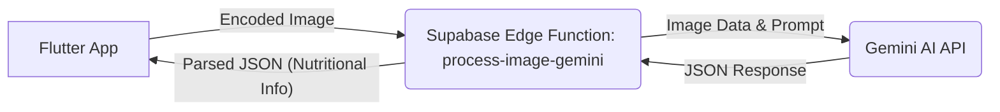

# Issue #7: AI Calorie Estimation with Image Recognition

## Overview
This feature enables users to take a photo of their meal or select an image from their gallery, and the Tonton app will analyze the food image to estimate its nutritional information (calories, protein, fat, carbs), name, and description. This is achieved by integrating with the Gemini AI model via a Supabase Edge Function.

## Implementation Architecture
The architecture follows a three-tier approach:
1.  **Flutter App (Client)**: Handles image selection/capture, sends the image data to the Supabase Edge Function, and displays the results.
2.  **Supabase Edge Function (Middleware)**: Receives the image data from the app, preprocesses it if necessary, calls the Gemini AI API, and then formats the AI's response before sending it back to the Flutter app.
3.  **Gemini AI (Backend)**: Google's multimodal AI model that performs the actual image analysis and nutritional estimation.



## Key Components

### Flutter App Components
-   **AIService (`lib/services/ai_service.dart`)**:
    *   This service class is responsible for all AI-related functionalities.
    *   The `estimateNutritionFromImageFile(File imageFile)` method:
        *   Reads the image file into bytes.
        *   Encodes the image bytes to a Base64 string.
        *   Determines the MIME type of the image.
        *   Invokes the `process-image-gemini` Supabase Edge Function, passing the Base64 image data and MIME type.
        *   Receives the JSON response from the Edge Function.
        *   Parses the JSON response into an `EstimatedMealNutrition` data model.
        *   Includes error handling for API calls and data parsing.
    ```dart
    // Snippet from AIService.estimateNutritionFromImageFile
    final base64Image = base64Encode(bytes);
    final mimeType = lookupMimeType(imageFile.path) ?? 'image/jpeg';
    final response = await _supabaseClient.functions.invoke(
      'process-image-gemini',
      body: {
        'imageData': base64Image,
        'mimeType': mimeType,
      },
    );
    // ... parse response ...
    ```

-   **UI Integration (`lib/screens/meal_input_screen.dart`)**:
    *   The `MealInputScreen` allows users to select an image from the gallery or capture one using the camera via `image_picker`.
    *   A preview of the selected image is displayed.
    *   Buttons trigger the `_triggerImageEstimation` method, which calls the `aiEstimationProvider`.
    *   The UI listens to state changes from `aiEstimationProvider` to display loading indicators, results, or error messages.
    *   Upon successful analysis, the estimated nutritional values (meal name, description, calories, protein, fat, carbs) are automatically populated into the respective `TextEditingController`s on the form.
    ```dart
    // Snippet from MealInputScreen - triggering estimation
    ref.read(aiEstimationProvider.notifier).estimateNutritionFromImageFile(_selectedImageFile!);

    // Snippet from MealInputScreen - observing results
    final estimationState = ref.watch(aiEstimationProvider);
    estimationState.when(
      data: (nutrition) {
        if (nutrition != null) {
          // Auto-fill fields
          _mealNameController.text = nutrition.mealName;
          _descriptionController.text = nutrition.description;
          _caloriesController.text = nutrition.calories.toString();
          // ... and so on for protein, fat, carbs
        }
      },
      loading: () => // Show loading indicator,
      error: (error, stack) => // Show error message,
    );
    ```

-   **State Management (`lib/providers/ai_estimation_provider.dart`)**:
    *   Uses `flutter_riverpod` for state management.
    *   `aiServiceProvider`: Provides an instance of `AIService`.
    *   `AIEstimationNotifier`: A `StateNotifier` that manages the asynchronous state (`AsyncValue<EstimatedMealNutrition?>`) of the image analysis process.
        *   It exposes the `estimateNutritionFromImageFile(File imageFile)` method, which calls the corresponding `AIService` method and updates its state to loading, data (on success), or error.
    *   `aiEstimationProvider`: A `StateNotifierProvider` that allows the UI to watch and interact with `AIEstimationNotifier`.

### Supabase Edge Function
-   **Function Name**: `process-image-gemini`
    *   Located at `supabase/functions/process-image-gemini/index.ts`.
-   **Implementation**:
    *   Written in TypeScript and runs on Deno.
    *   Receives `imageData` (Base64 encoded string) and `mimeType` in the request body.
    *   Retrieves the `GEMINI_API_KEY` from environment variables.
    *   Constructs a request to the Gemini AI API, including the image data and a specific prompt (see "Prompt Engineering" below).
    *   Specifies `application/json` as the desired `response_mime_type` from Gemini.
    *   Sends the request to the Gemini API (`gemini-1.5-flash-latest` model).
    *   Parses the JSON response from Gemini.
    *   Returns the parsed nutritional information as a JSON response to the Flutter app.
    ```typescript
    // Snippet from process-image-gemini/index.ts - Gemini API call
    const geminiResponse = await fetch(
      `${GEMINI_API_URL}/${GEMINI_MODEL_NAME}:generateContent?key=${GEMINI_API_KEY}`,
      {
        method: 'POST',
        headers: { 'Content-Type': 'application/json' },
        body: JSON.stringify({
          contents: [/* ... prompt and image data ... */],
          generation_config: { temperature: 0.4, response_mime_type: "application/json" }
        })
      }
    );
    ```
-   **Error Handling**:
    *   Validates that `imageData` and `mimeType` are provided.
    *   Handles errors during the Gemini API call (e.g., network issues, API errors) and returns appropriate HTTP status codes and error messages.
    *   Handles errors during the parsing of Gemini's response.
    *   Includes CORS headers to allow requests from the Flutter app.

### Gemini AI Integration
-   **Model Used**: `gemini-1.5-flash-latest` (as specified in the Edge Function).
-   **Prompt Engineering**:
    *   The Edge Function sends a carefully crafted text prompt along with the image to guide the AI. The prompt requests specific information in a JSON format:
    ```
    Analyze this food image and provide the following information in valid JSON format. For a Japanese dish, use both Japanese and English names. Include: 1) food_name: Name of the dish or food item, 2) description: Brief description of what it is, 3) calories: Estimated calories per serving (number only), 4) protein_g: Protein in grams (number only), 5) fat_g: Fat in grams (number only), 6) carbs_g: Carbohydrates in grams (number only)
    ```
-   **Response Format**:
    *   The Gemini API is configured to return a JSON response (`response_mime_type: "application/json"`).
    *   The expected JSON structure from Gemini (based on the prompt) is:
        ```json
        {
          "food_name": "Example Dish",
          "description": "A brief description of the example dish.",
          "calories": 350,
          "protein_g": 20,
          "fat_g": 15,
          "carbs_g": 30
        }
        ```
    *   This JSON is then parsed by the Flutter app into the `EstimatedMealNutrition` model:
        *   `mealName` (from `food_name`)
        *   `description`
        *   `calories`
        *   `nutrients` (an object containing `protein`, `fat`, `carbs` mapped from `protein_g`, `fat_g`, `carbs_g`)

## Functionality Achieved
-   Users can select an image from their device gallery or take a new photo using the camera.
-   The selected image is sent to the backend for analysis.
-   The app receives estimated nutritional information (meal name, description, calories, protein, fat, carbohydrates).
-   This information automatically populates the relevant fields in the meal input form.
-   Loading states and error messages are displayed to the user during the process.
-   **Examples of foods that work well**: Clear images of single, common dishes (e.g., a bowl of ramen, a slice of pizza, an apple).

## Current Limitations
-   **Accuracy**: AI estimations are not 100% accurate and should be treated as suggestions. Accuracy can vary based on image quality, food complexity, and portion size ambiguity.
-   **Image Quality**: Poorly lit, blurry, or obstructed images may lead to inaccurate results or analysis failure.
-   **Multiple Food Items**: The current prompt is optimized for a single primary food item in the image. Complex meals with multiple distinct items might not be analyzed component-wise.
-   **Portion Size**: The AI estimates nutrition based on the visible portion but cannot accurately determine the exact weight or volume, which is crucial for precise calorie counts. The prompt does not currently ask for portion size estimation.
-   **Performance**: Analysis time can vary depending on image size, network speed, and Gemini API response times. Large images are not explicitly resized before being sent as Base64 in `AIService`, which could be a performance bottleneck (though `image_picker` has some constraint options). The PoC `FINDINGS.md` mentioned resizing, but the current `AIService` doesn't show this for the `estimateNutritionFromImageFile` path.
-   **Cost**: Each API call to Gemini incurs a cost. Frequent use or inefficient handling could lead to higher operational costs.

## Testing and Validation
-   Development testing involved using sample images of common food items.
-   The PoC phase included more structured testing, the results of which are detailed in `ImagePoc/image_poc/FINDINGS.md`.
-   Error handling for network issues, API errors, and data parsing failures was implemented and tested during development.
-   The UI correctly reflects loading, success (auto-filling forms), and error states.
-   Independent operation of the Tonton app (without ImagePoc) after deploying the Edge Function from Tonton's own `supabase/functions` directory was a key validation point.

## Future Improvements
-   **Advanced Image Preprocessing**: Implement client-side image compression and resizing before Base64 encoding to improve performance and reduce costs.
-   **Portion Size Estimation**: Explore ways to allow users to specify portion size or attempt AI-based portion estimation (a more complex AI task).
-   **Multiple Food Item Detection**: Investigate using object detection models (either before Gemini or a feature within a more advanced Gemini model) to identify and analyze multiple food items in a single image.
-   **Feedback Mechanism**: Allow users to correct AI estimations, which could potentially be used to fine-tune prompts or a custom model in the future.
-   **Caching**: Cache results for identical images (e.g., using image hash) to reduce redundant API calls.
-   **More Robust JSON Parsing in Edge Function**: The PoC `FINDINGS.md` mentioned more robust JSON parsing (e.g., from markdown code blocks). The current Edge Function uses direct parsing; this could be enhanced if Gemini responses are inconsistent.

## Technical Details
-   **Dependencies (Flutter)**:
    *   `flutter_riverpod`: For state management.
    *   `image_picker`: For selecting images from gallery/camera.
    *   `supabase_flutter`: For interacting with Supabase (including Edge Functions).
    *   `mime`: For determining image MIME types.
    *   `image`: (Currently used in `uploadImageToSupabase` but not directly in `estimateNutritionFromImageFile` for resizing).
-   **Dependencies (Supabase Edge Function - Deno)**:
    *   `https://deno.land/std@0.177.0/http/server.ts`
-   **Configuration Requirements**:
    *   Supabase project set up.
    *   `process-image-gemini` Edge Function deployed to the Supabase project.
    *   `GEMINI_API_KEY` set as an environment variable (Secret) in the Supabase project settings for the Edge Function to access.
    *   Correct CORS settings for the Supabase project to allow invocations from the Flutter app.
-   **Performance Metrics**:
    *   Not formally benchmarked in the current Tonton implementation.
    *   Key factors: image upload time (dependent on size and network), Edge Function cold start time (if applicable), Gemini API processing time.

## Conclusion
The AI image-based calorie estimation feature (Issue #7) successfully integrates Gemini AI with the Tonton app, providing users with a convenient way to get an initial estimate of their meal's nutritional content. The architecture leverages Supabase Edge Functions for a scalable and maintainable backend bridge. While there are current limitations, particularly around accuracy and portion sizing, the feature establishes a strong foundation for future enhancements and significantly enriches the app's capabilities in meal tracking.
